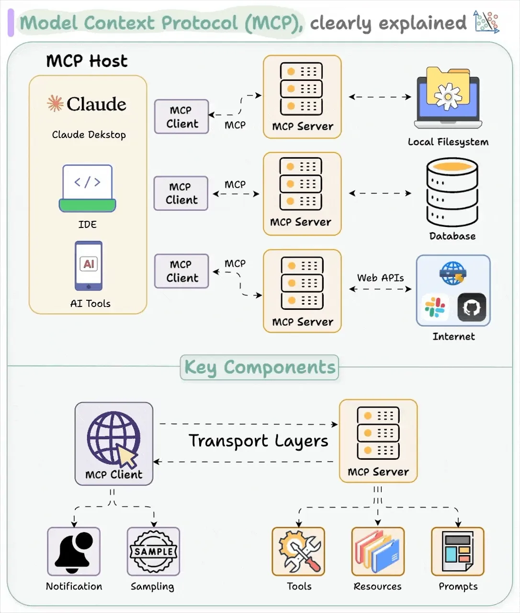

# Model Context Protocol Servers

<p>
  
</p>

[img source: Visual Guide to Model Context Protocol](https://blog.dailydoseofds.com/p/visual-guide-to-model-context-protocol)

## Project Description

This project focuses on the construction of custom Model Context Protocol (MCP) servers built using Python code. The project was inspired by Dave Ebbelaar's [MCP Crash Course for Python Developers](https://www.youtube.com/watch?v=5xqFjh56AwM). The project breaks away from the use of Personal MCP servers that rely on Claude Desktop, Cursor, or other personal AI assistants. Instead, the project shows how to build MCP into Python Applications and agent systems. My project produces similar outputs to the the _MCP Crash Course for Python Developers_ course, but differs in the construction of the MCP tools and especially in the use of Gemini AI for models versus OpenAI which is used in the _Course_. The implementations of Gemini AI models require differences in MCP protocol implementation, but for the most part the overall flow of events follow the same general methodologies as outlined by the MCP standard.

This project is important because it provides an understanding of how to build production systems that could use MCP in Python based applications.

Also, the project was simply a good way to learning more about this vastly popular standardization protocol.

#### The Project's Key Components:

- Understanding the technical architecture of MCP

- Building custom MCP servers using the Python Software Developer Kit (SDK)

  - I show some simple examples of MCP servers using `STDIO` and `STREAMABLE-HTTP` transports
  - I show how to build client testing code for these servers
  - I show how MCP differs from simple Python function calling
  - I show how you might build Docker containers to run MCP servers locally and remotely, as one might do in a production environment.

- Integrating these servers into Python applications

- Making informed decisions about when and how to use MCP

## Objective

The project contains the key elements:

- `Docker` to containerize an MCP server remote usage,
- `FastMCP` the Python framework that simplifies the creation of servers and clients using the Model Context Protocol (MCP), which standardizes how AI applications connect to data and tools,
- `Gemini AI`, Google's advanced AI model (e.g., LLM) that I use to generate various types of content, including text in conjunction with the MCP server and its MCP tools, prompts, and resources.
- `gemini-2.5-flash` the generative AI model that I used,
- `Git` (version control),
- `MCP` the protocol standardizing how AI applications connect to data and tools,
- `Node.js` JavaScript runtime environment to help run MCP inspector,
- `NPM` Node Package Manager the default packet manager for Node.js,
- `Prompt Engineering` to provide instructions for the LLM on how to retrieve information,
- `Python` the standard modules, and
- `uv` package management including use of `ruff` for linting and formatting.

---

## Tech Stack


## Getting Started

Here are some instructions to help you set up this project.

---

## Installation Steps

### Prerequisites

- To run MCP inspector you will need to make sure you have [Node.js](https://nodejs.org/en/download) and [NPM](https://nodejs.org/en/download) installed on your machine.

- Set up your Gemini AI API key in a `.env` file. See `.env.example` as an example

### Get the code -- Clone the Repo

1. Clone the repo (or download it as a zip file):

   ```bash
   git clone https://github.com/beenlanced/ai_mcp_server.git
   ```

2. Create a virtual environment named `.venv` using `uv` Python version 3.12:

   ```bash
   uv venv --python=3.12
   ```

3. Activate the virtual environment: `.venv`

   On macOS and Linux:

   ```bash
   source .venv/bin/activate #mac
   ```

   On Windows:

   ```bash
    # In cmd.exe
    venv\Scripts\activate.bat
   ```

4. Install packages using `pyproject.toml` or (see special notes section)

   ```bash
   uv pip install -r pyproject.toml
   ```

### Running the Code

- Follow the instructions in each of the MCP directories on how to operate the MCP servers and the clients.

## References

[1] [MCP Python SDK](https://github.com/modelcontextprotocol/python-sdk?tab=readme-ov-file)

[2] [FastMCP](https://gofastmcp.com/getting-started/welcome)

[3] [Model Context Protocol(MCP) with Google Gemini 2.5 Pro — A Deep Dive (Full Code)](https://medium.com/google-cloud/model-context-protocol-mcp-with-google-gemini-llm-a-deep-dive-full-code-ea16e3fac9a3)

[4] [Understanding MCP Basics](https://www.youtube.com/watch?v=5xqFjh56AwM)
using remote server

---

## Final Words

Thanks for visiting.

Give the project a star (⭐) if you liked it or if it was helpful to you!

You've `beenlanced`! 😉

---

## Acknowledgements

I would like to extend my gratitude to all the individuals and organizations who helped in the development and success of this project. Your support, whether through contributions, inspiration, or encouragement, have been invaluable. Thank you.

Specifically, I would like to acknowledge:

- Dave Ebbelaar's [MCP Crash Course for Python Developers](https://www.youtube.com/watch?v=5xqFjh56AwM)

- [Hema Kalyan Murapaka](https://www.linkedin.com/in/hemakalyan) and [Benito Martin](https://martindatasol.com/blog) for sharing their README.md templates upon which I have derived my README.md.

- The folks at Astral for their UV [documentation](https://docs.astral.sh/uv/)

---

## License

This project is licensed under the MIT License - see the [LICENSE](./LICENSE) file for details
